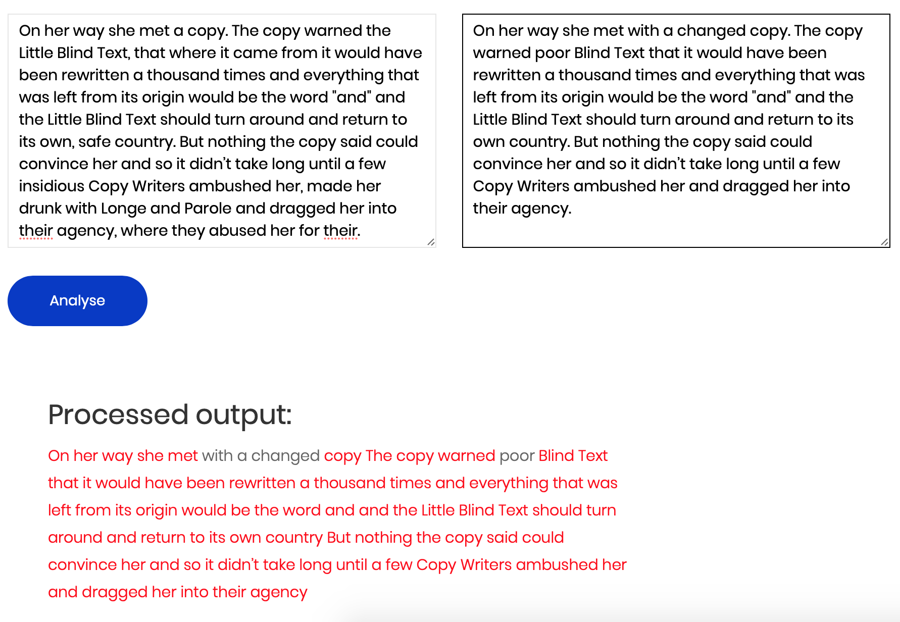

# Plaker

Quickly check and visualise plagiarism between two documents.


## Requirements
```
Flask==1.0.2
Flask-WTF==0.14.2
```

## Installation

### Without Docker
```
pip install -r requirements.txt
python main.py
# visit http://localhost:5000
```

### With Docker
```bash
docker build -t plaker .
docker run -p 5000:80 -t plaker
# visit http://localhost:5000
```

## Screenshot



